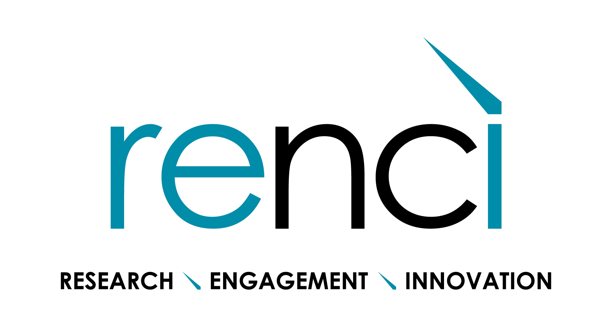
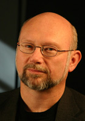
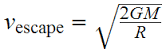
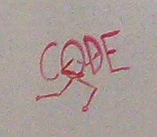

class: irods-slide-tiger, center

# Building the iRODS Consortium
### One project's journey from academic code to enterprise software

 Presented at *All Things Open 2014*
 October 22, 2014

  Dan Bedard (danb@renci.org)
 The iRODS Consortium
---
layout: true
class: irods-slide-2

---
# What's this all about?

--
* iRODS software manages around 100 PB of data worldwide.
* (It's open source.)
* It started as a sponsored research project at UCSD.
* Now it's managed by the iRODS Consortium.

???
University of California at San Diego

---
# This talk is about...

--
* What iRODS is.
* How and why the iRODS Consortium came to be.
* How the Consortium works.
* Lessons learned and challenges.

--
  
* Thirty minutes long.

???
This talk is also about...

---
# But first...

???
But before I get into what iRODS is, I should explain a few things

--
* Dan Bedard is not a software developer.

???
I am not a software developer. I am the market development manager for iRODS.
I try to make sure our users are happy and I help connect them with
Consortium resources. Some users have a high stake in what we do with iRODS,
so I try to convince them to join the Consortium.

--

* The iRODS Consortium is based at RENCI.

* RENCI is based at the University of North Carolina at Chapel Hill.

* RENCI is an applied research organization that helps other departments at UNC.

???
RENCI: mostly computer science. Works with other UNC departments to enhance their
research. Often add the missing piece or connect research groups to make them much
more successful when pursuing funding (not to mention completing a project)

---
# What is iRODS?

.big3[iRODS is open source middleware for...]  

.big3[Data Discovery,]

.big3[Workflow Automation,]

.big3[Secure Collaboration,]

.big3[and Data Virtualization.]

---
# What is iRODS?

.big3[iRODS is open source middleware for...] 
.red[↑sits between the user/admin and the file system]

.big3[Data Discovery,].red[←metadata annotation]

.big3[Workflow Automation,]
.red[←über chron]

.big3[Secure Collaboration,]
.red[←consolidated access and control data across sites]

.big3[and Data Virtualization.]
.red[←all your storage in a single namespace]

???
Workflow Automation: use any condition to trigger any action. e.g., delete a file
after it has been accessed 30 times.

---
# What is iRODS?

iRODS makes huge sets of unstructured data manageable, usable, and shareable.

--

Broad usage in...
* genomics and life sciences (Sanger, Broad, BGI, Lineberger)
* large scientific data sets (NASA, NOAA, NAOA)
* digital libraries (French National Library, SNIC)

--

.center.big3[[irods.org](http://irods.org)]

???
Climate data

National Optical Astronomy Observatory

SNIC - Swedish National Infrastructure for Computing. SweStore

---
# iRODS History, Early Years

--
<b>1995</b> - Storage Resource Broker (SRB) developed by General Atomics,
Data&nbsp;Intensive&nbsp;Cyber&nbsp;Environments group (DICE) at UCSD, and
San&nbsp;Diego&nbsp;Supercomputer&nbsp;Center (SDSC) under DARPA funding.

* Forked into a closed source commercial product and a free non-commercial product.
(Source code was available upon request.)

--

<b>2006</b> -  DICE deprecates SRB. Builds a new system around a *"rule engine"* and re-writes
SRB concepts into a new system. Calls it iRODS.

* The iRODS rule engine enables policy definition. (Any condition, any action.)

--

<b>2008</b> - DICE group expands. Some staff at UNC, some at UCSD.

--

<b>2011</b> - An inflection point.

---
# iRODS in 2011

???
Let's take a moment to discuss where iRODS was in 2011.

--
<table style="font-size:.5em;" align="center">
<tr><td>EarthCube Layered Architecture</td><td>NSF</td><td>4/1/2012 – 3/31/2013</td></tr>
 <tr><td>DFC Supplement for Extensible Hardware</td><td>NSF</td><td>9/1/2011 – 8/31/2015</td></tr>
 <tr><td>DFC Supplement for Interoperability</td><td>NSF</td><td>9/1/2011 – 8/31/2015</td></tr>
 <tr><td>DataNet Federation Consortium</td><td>NSF</td><td>9/1/2011 – 8/31/2016</td></tr>
 <tr><td>SDCI Data Improvement</td><td>NSF</td><td>10/1/2010 – 9/30/2013</td></tr>
 <tr><td>Subcontract: Temporal Dynamics of Learning Center</td><td>NSF</td><td>1/1/2010 – 12/31/2010</td></tr>
 <tr><td>National Climatic Data Center</td><td>NOAA</td><td>10/1/2009 – 9/1/2010</td></tr>
 <tr><td>NARA Transcontinental Persistent Archive Prototype</td><td>NSF</td><td>9/15/2009 – 9/30/2010</td></tr>
 <tr><td>Subcontract: Temporal Dynamics of Learning Center</td><td>NSF</td><td>3/1/2009 – 12/31/2009</td></tr>
 <tr><td>Transcontinental Persistent Archive Prototype</td><td>NSF</td><td>9/15/2008 – 8/31/2013</td></tr>
 <tr><td>Petascale Cyberfacility for Seismic Community</td><td>NSF</td><td>4/1/2008 – 3/30/2010</td></tr>
 <tr><td>Data Grids for Community Driven Applications</td><td>NSF</td><td>10/1/2007 – 9/30/2010</td></tr>
 <tr><td>Joint Virtual Network Centric Warfare</td><td>DOD</td><td>11/1/2006 – 10/30/2007</td></tr>
 <tr><td>Petascale Cyberfacility for Seismic</td><td>NSF</td><td>10/1/2006 – 9/30/2009</td></tr>
 <tr><td>LLNL Scientific Data Management</td><td>LLNL</td><td>3/1/2005 – 12/31/2008</td></tr>
 <tr><td>NARA Persistent Archives</td><td>NSF</td><td>10/1/2004 – 6/30/2008</td></tr>
 <tr><td>Constraint-based Knowledge</td><td>NSF</td><td>10/1/2004 – 9/30/2006</td></tr>
 <tr><td>NDIIPP California Digital Library</td><td>LC</td><td>2/1/2004 – 1/31/2007</td></tr>
 <tr><td>NASA Information Power Grid</td><td>NASA</td><td>10/1/2003 – 9/30/2004</td></tr>
 <tr><td>National Science Digital Library</td><td>NSF</td><td>10/1/2002 – 9/30/2006</td></tr>
 <tr><td>NARA Persistent Archive</td><td>NSF</td><td>6/1/2002 – 5/31/2005</td></tr>
 <tr><td>SCEC Community Modeling</td><td>NSF</td><td>10/1/2001 – 9/30/2006</td></tr>
 <tr><td>Particle Physics Data Grid</td><td>DOE</td><td>8/15/2001 – 8/14/2004</td></tr>
 <tr><td>Grid Physics Network</td><td>NSF</td><td>7/1/2000 – 6/30/2005</td></tr>
 <tr><td>Digital Library Initiative UCSB</td><td>NSF</td><td>9/1/1999 – 8/31/2004</td></tr>
 <tr><td>Digital Library Initiative Stanford</td><td>NSF</td><td>9/1/1999 – 8/31/2004</td></tr>
 <tr><td>Persistent Archive</td><td>NARA</td><td>9/1999 – 8/2000</td></tr>
 <tr><td>Information Power Grid</td><td>NASA</td><td>10/1/1998 – 9/30/1999</td></tr>
 <tr><td>Terascale Visualization</td><td>DOE</td><td>9/1/1998 – 8/31/2002</td></tr>
 <tr><td>Persistent Archive</td><td>NARA</td><td>9/1998 – 8/1999</td></tr>
 <tr><td>NPACI data management</td><td>NSF</td><td>10/1/1997 – 9/30/1999</td></tr>
 <tr><td>DOE ASCI</td><td>DOE</td><td>10/1/1997 – 9/30/1999</td></tr>
 <tr><td>Distributed Object Computation Testbed</td><td>DARPA/USPTO</td><td>8/1/1996 – 12/31/1999</td></tr>
 <tr><td>Massive Data Analysis Systems</td><td>DARPA</td><td>9/1/1995 – 8/31/1996</td></tr>
</table>

???
iRODS was the product of 16 years of funded research. This is a long list! Like... 30?

---
# iRODS in 2011

.center[]

???
RENCI and the DICE group were collaborating fairly successfully.
The groups were jointly deploying iRODS on projects across campus. 

---
<h1>iRODS in 2011</h1>

.container[
.thumbnail-left[]
.tight.bubble-right[.triangle-border.left[We want to manage (even more) massive amounts
 of climate data using iRODS...]]
.bubble-right[.triangle-border.left[but we have to do a security audit for each new
 version.]]]

???
But we were also hearing feedback like this.

--
  
.container[
.tight.bubble-right[.triangle-border-green.left[We're thinking about funding iRODS-based
 federation between research groups...]]
 .thumbnail-left[]
.bubble-right[.triangle-border-green.left[What's your plan for long-term sustainability?]]
]

---
# iRODS in 2011

iRODS was used in many research groups worldwide because:
* It does things that no other software does...

--
* for free.

--
* And the DICE group was able to support the needs of the user community.

--

But...

--

* Today's grant funding doesn't provide for tomorrow's support.

--
* The iRODS architecture could be unwieldy.

--
* And the development and support community might be difficult to scale.

???
For example, no packaged installation. Not modular or pluggable, so developer would
have to understand the whole system to work on a small part of it... and risked landmines.

---
<h1>iRODS in 2011</h1>
  

.thumbnail-left[ Stan Ahalt Director@RENCI]
.tight.bubble-right[.triangle-border-green.left[iRODS is an asset to RENCI.]]
--
.tight.bubble-right[.triangle-border-green.left[And lots of people are using it.]]
--
.tight.bubble-right[.triangle-border-green.left[But no one will pay to sustain it.]]
--
.tight.bubble-right[.triangle-border-green.left[Unless...]]

---
<h1>iRODS in 2011</h1>
  

.thumbnail-left[ Stan Ahalt Director@RENCI]
.tight.bubble-right[.triangle-border-green.left[We need an enterprise-ready iRODS.]]

---
# iRODS History: 2012-2014

<b>2012</b> - RENCI forks and creates E-iRODS. Forms the iRODS Consortium.
.center[. . . ]
<b>2014</b> - E-iRODS and Community iRODS merged into iRODS 4.0.

???
After analysis, discussion, and "blessing" from DICE. I'll come back to what happened in
between in a little bit

--

iRODS 4.0 and beyond are enterprise-ready.
* Pluggable architecture
* Packaged installation.
* More extensive testing and continuous integration.

---
# The iRODS Consortium

* Founded after discussion with a Major Stakeholder.
* Founding members would be RENCI, DICE, and that Major Stakeholder.

???
RENCI worked with major stakeholder to figure out the non-technical side (i.e., funding)
Major Stakeholder suggested a similar model to HPSS, where National Labs largely funded
feature development

--
  
* Operating model based on the Kerberos Foundation.
  - Tests and certifies outside vendors' code.

???
But after we spoke with several different consortia. Kerberos seemed most appropriate.
Kereberos, like us, decided to stay entirely within their host university.

---
# The iRODS Consortium: Funding Model

* iRODS stakeholders join to protect their infrastructure investment.
  - Four levels of membership ($10k to $150k annually).
  - Increasing influence (voting) and priority (support).

???
We considered alternative ways to structure membership. Felt this was most appropriate and
manageable

--
  
* Additionally: system integration, standby support, and training.

???
Recognizing that the need exists... we added system integration

---
# The iRODS Consortium: Governance

* <b>Executive Committee</b> - Approves budgets, staffing, major release plans

* <b>Planning Committee</b> - Develops software release roadmaps, establishes working groups

* <b>Technology Working Group</b> - Discusses technical approaches, open issues

???
Obviously, this is all spelled out in more detail in our bylaws

---
# So what happened in between?

???
Remember the iRODS History 2012-2014 slide

--
# iRODS History: 2012-2014

<b>2012</b> - RENCI forks and creates E-iRODS. Forms the iRODS Consortium.
.center[. . . ]
<b>2014</b> - E-iRODS and Community iRODS merged into iRODS 4.0.

---
# So what happened in between?

* Creation of the Consortium Plan.

--

* Major Stakeholder required merge before they would sign on to the Consortium.

???
Or at least, the intent to merge

--

* March 2013: Merge plan announced.

--

* September 2013: Brand Fortner joins as Executive Director

???
This was important because it showed that the Consortium was becoming a real thing with
full-time employees.

--

* March 2014: iRODS 4.0 released. First Consortium members join.

--

* October 2014: The Consortium has six members: RENCI, DICE, DDN, Seagate, WTSI, and EMC 

???
Major Stakeholder is still not a Consortium member!

---
# Why not become a private company?

Partly about keeping our user community happy.

???
It might be seen as impropriety to spin off. Users were uncertain of whom to follow during
the fork.

--
  Also...

.center[]

The escape velocity for spinning out of UNC seemed to high at the time.

--
* A *lot* of work and risk involved.

???
Work that would take away from time doing what we wanted to do... which was build running
code.

--
* High value of being at RENCI.

???
University provides office space, legal counsel, marketing, security... oh, and computers.

It seemed like a good way to minimize the risk of getting started

At the time, weren't sure we could make enough selling support alone 
(this might change some day), but think about it: Who are your customers?
People with PB of data = People who can solve the easy problems on their own.
And grad students are cheap.

---
# Lessons Learned

--
* Don't underestimate how long this will take.
  - Staying with the University was slow, but low risk.
  - Convincing the community that this is real takes time.

???
* The university doesn't come with a massive influx of cash, so you don't get market presence, but...
* Value proposition... and this won't fall over.
* Flux in the communities slowed things down. And we didn't have a fully evolved support model.

--
  
* It's difficult to change what you're doing and how you're doing it at the same time.

???
* "It's difficult..." I stole this idea from a presentation I saw last week.

--
  
* Think clearly and thoroughly about what your objectives are.

???
* We aren't on a path to an IPO.

--
  
* Structure matters.

???
This is why you shouldn't do this in isolation.

--
  
* You need Major Stakeholders and evangelicals.

???
* Just as you need to pay attention to your user community for technical feedback, they
can help you with your non-technical structure as well.

---
# Lessons Learned

* At the end of the day, you need something that solves the problem better or cheaper than anyone else.

.center[]
.center["Running code wins the day."]

---
# Building a Consortium

<b>Phase 1 - Ideation:</b> articulating the idea and vision

<b>Phase 2 - Formation:</b> getting early members, establishing the community

<b>Phase 3 - Early Implementation:</b> establishing programs, working groups, bylaws, begin to show value & build momentum 

<b>Phase 4 - General implementation:</b> new programs, growing existing programs, increasingly member driven as founders give up some control

<b>Phase 5 - Stabilization:</b> A sustainable, member-driven organization, possibly with professional managers/administrators

---
# Building a Consortium

<b>Phase 1 - Ideation:</b> articulating the idea and vision

<b>Phase 2 - Formation:</b> getting early members, establishing the community

<b>Phase 3 - Early Implementation:</b> establishing programs, working groups, bylaws, begin to show value & build momentum 

.red[We think we're right around here.]

<b>Phase 4 - General implementation:</b> new programs, growing existing programs, increasingly member driven as founders give up some control

<b>Phase 5 - Stabilization:</b> A sustainable, member-driven organization, possibly with professional managers/administrators

---
# "Last Slide Stuff"

* Thank you to:
  * David Knowles, Charles Schmitt, Stan Ahalt, Jason Coposky, and
 Terrell&nbsp;Russell for historical context.
 
  * The entire iRODS Consortium team for their continuing efforts.
   
* These slides licensed under Creative Commons

 http://creativecommons.org/licenses/by-sa/4.0/
   
* These slides made with http://remarkjs.com/

???
I stole this too.

---
class: center middle irods-slide-2

# Questions? 
# Suggestions?

